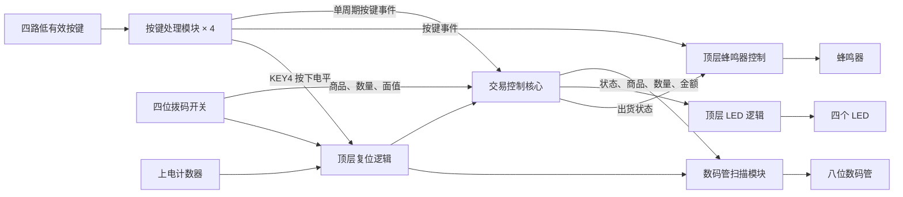
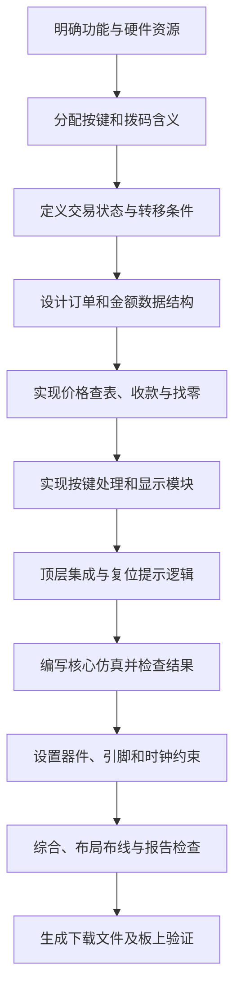
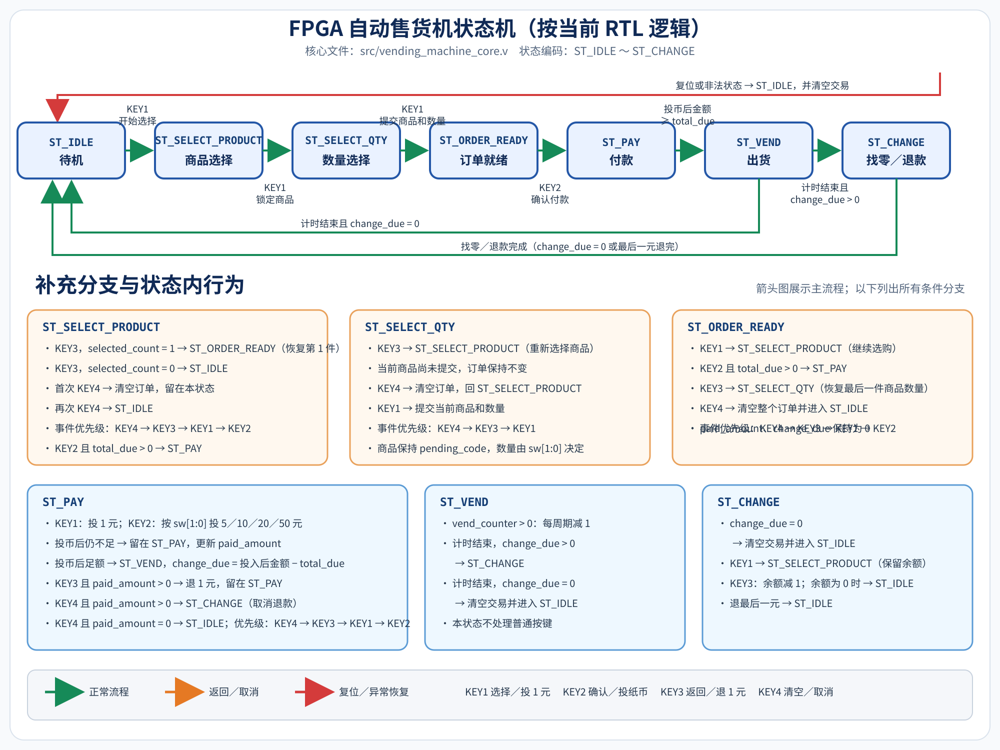

# 基于 FPGA 的自动售货机系统设计文档

编写日期：2026 年 9 月 6 日  
设计对象：HX7A75C 自动售货机 Verilog 工程  
顶层模块：`vending_machine_top`  
目标器件：Xilinx Artix-7 `xc7a75tfgg484-2`

## 1. 设计概述

本系统利用 FPGA 实现自动售货机的交易控制过程。用户通过四位拨码开关和四个按键，完成商品选择、数量选择、订单确认、投币、取消和找零操作；系统通过八位七段数码管、四个 LED 和蜂鸣器反馈当前状态。

系统采用单时钟、模块化设计，将机械按键处理、交易控制、显示驱动分离，在顶层完成连接与声光提示。主时钟频率为 50 MHz，来自约束文件中的 20 ns 时钟周期定义。

本文根据当前源代码整理系统框架、设计流程、模块分配和实际功能。2026-09-07 修改选择阶段按键逻辑后，使用 Vivado 2022.2 重新运行核心行为仿真，输出 PASS；本次未重新执行综合、实现或板上测试，历史构建结果不代表本次修改后的硬件验证。

### 1.1 功能要求与实现范围

| 功能项 | 当前实现 |
|---|---|
| 商品种类 | 16 种，编号 A11～A44，价格固定 |
| 数量选择 | 每种商品选择 1～3 件 |
| 订单容量 | 最多保存两种不同商品 |
| 修改订单 | 重选已有商品会覆盖数量；新增第三种商品会替换第二种商品 |
| 金额计算 | 根据商品单价与数量自动计算订单总价 |
| 投币付款 | KEY1 模拟投入 1 元；KEY2 模拟投入 5、10、20、50 元 |
| 出货控制 | 付款达到总价后自动进入出货状态，默认保持约 1 秒 |
| 找零余额复用 | KEY1 可从找零/退款状态开始新订单；余额优先抵扣新订单，不足时继续投币 |
| 取消操作 | 选择阶段 KEY3 回退、KEY4 首次清空再次待机，付款阶段取消后退回已投金额 |
| 显示提示 | 数码管显示交易数据，LED 指示状态，蜂鸣器提示按键和出货 |
| 复位 | 支持上电复位，以及拨码全 1 配合 KEY4 的手动复位 |

当前系统是交易控制演示。顶层没有实物货币识别器、货道电机、出货检测器或退币机构接口，出货和退币通过内部事件及声光输出体现；未实现库存管理、交易记录和断电恢复。

## 2. 系统框架

### 2.1 总体结构



各模块共用 `clk`。图中省略公共时钟和部分复位连线；KEY1～KEY3 的按键处理实例接系统复位，KEY4 实例的复位端固定为 0。

系统可分为三层：输入处理层将机械按键转换为可靠事件；交易控制层解释事件、保存订单并完成结算；输出层将交易信息转换为显示和声光提示。顶层承担模块集成和公共控制。

### 2.2 控制流与数据流

控制流为“按键事件 → 状态判断 → 执行操作 → 状态转移 → 输出反馈”。同一个按键在不同状态下具有不同意义，例如 KEY1 在选择阶段用于推进选择，在付款阶段用于投 1 元。

数据流为“拨码编码 → 锁存商品 → 选择数量 → 更新订单 → 计算总价 → 累加付款 → 计算找零 → 逐元退回”。商品确认后使用 `pending_code` 保存编码，因此数量选择期间修改拨码不会改变已锁定商品。

### 2.3 顶层接口

| 端口 | 方向 | 位宽 | 功能 |
|---|---|---:|---|
| `clk` | 输入 | 1 | 50 MHz 系统时钟 |
| `sw` | 输入 | 4 | 按阶段提供商品、数量或纸币编码 |
| `key_n` | 输入 | 4 | KEY1～KEY4，按下为低电平 |
| `led` | 输出 | 4 | 已有订单、付款、出货、找零/退币提示 |
| `seg` | 输出 | 8 | 七段字形及小数点控制 |
| `sel` | 输出 | 8 | 数码管位选 |
| `buzzer` | 输出 | 1 | 蜂鸣器驱动波形 |

## 3. 模块分配

| 模块 | 文件 | 实例数 | 职责 |
|---|---|---:|---|
| 顶层集成 | `src/vending_machine_top.v` | 1 | 外设连接、复位生成、按键功能连接、LED 与蜂鸣器控制 |
| 按键处理 | `src/button_conditioner.v` | 4 | 输入同步、稳定时间消抖、按下沿单脉冲输出 |
| 交易核心 | `src/vending_machine_core.v` | 1 | 状态机、商品订单、价格计算、收款、出货计时和退款 |
| 显示扫描 | `src/seven_segment_scan.v` | 1 | 显示字段选择、十进制拆分、段码译码、八位动态扫描 |
| 核心测试平台 | `sim/tb_vending_machine_core.v` | 仿真专用 | 产生时钟和按键事件，检查状态及金额 |

工程辅助文件包括 `constraints/hx7a75c_vending_machine.xdc` 和 `scripts/` 下三个 Tcl 脚本，分别负责引脚/时序约束及工程创建、仿真、实现。

### 3.1 顶层模块设计

顶层实例化四个按键处理模块、一个交易核心和一个显示模块，并完成下列逻辑：

1. 20 位上电计数器从 0 计至全 1，其间保持系统复位，持续约 20.97 ms。
2. 当 `sw == 4'hF` 且 KEY4 消抖后的电平为按下时，产生手动复位。
3. 当拨码不是全 1 时，KEY4 的按下脉冲作为普通取消事件传入核心。
4. 根据订单种数、状态和事件控制 LED。
5. 任意按键事件触发约 50 ms 提示音，出货期间持续发声。

LED 分配如下：

| LED | 代码条件 | 含义 |
|---|---|---|
| LED1 | `selected_count != 0` | 至少确认了一种商品 |
| LED2 | `state == ST_PAY` | 正在付款 |
| LED3 | 出货状态或 `vend_pulse` | 出货提示 |
| LED4 | 找零状态或 `return_coin_pulse` | 找零/退款或单次退币事件 |

蜂鸣器使用自由运行的 16 位计数器第 15 位，频率约为 `50,000,000 / 65,536 = 762.94 Hz`；关闭时输出高电平。按键短响计数值为 2,500,000，重复按键会重新计时。提示音表示检测到按键，不保证当前状态执行了业务操作。

### 3.2 按键处理模块设计

输入 `btn_n` 先取反，转换为按下有效信号，再经过两级寄存器 `sync_reg` 同步。同步值与当前消抖电平一致时清零计数；不一致时累计时间，达到阈值后才改变消抖电平。

默认 `DEBOUNCE_TICKS = 500_000`，50 MHz 下对应约 10 ms。按下和释放均需要稳定时间，参数应为正整数。

输出包括：

- `pressed_level`：稳定的按下电平，可用于长按或组合复位。
- `pressed_pulse`：由 `debounced & ~debounced_d` 生成的按下沿事件，仅保持一个时钟周期。

通过这一处理，机械抖动不会直接形成多次交易事件，长按也不会持续重复触发操作。

### 3.3 交易核心模块设计

核心以一个 `always @(posedge clk or posedge reset)` 过程实现状态寄存器和交易数据更新，在 `case(state)` 中定义各阶段行为。输出事件脉冲在每个非复位周期先清零，仅在对应操作发生时置 1。

| 数据 | 位宽 | 用途 |
|---|---:|---|
| `state` | 3 | 七个交易状态的编码 |
| `selected_count` | 2 | 已选商品种数，取 0、1、2 |
| `has_item1/has_item2` | 各 1 | 两个订单槽的有效标志 |
| `item1_code/item2_code` | 各 4 | 两个已确认商品的编码 |
| `item1_qty/item2_qty` | 各 2 | 各商品的已确认数量 |
| `pending_code` | 4 | 数量选择期间锁定的商品 |
| `current_product_code` | 4 | 当前操作或显示的商品 |
| `current_quantity` | 2 | 当前操作或显示的数量 |
| `current_price` | 8 | 当前商品的组合查表单价，顶层未用于显示 |
| `total_due` | 8 | 已确认订单总价 |
| `paid_amount` | 8 | 付款阶段尚未结算的已投金额 |
| `change_due` | 8 | 待找零、退款或保留给下一笔订单的余额 |
| `vend_counter` | 32 | 出货阶段剩余计数 |
| `vend_pulse` | 1 | 开始出货的单周期事件 |
| `return_coin_pulse` | 1 | 单次退回 1 元的单周期事件 |

核心内部通过函数和任务复用硬件描述：`price_of` 查询价格；`qty_from_switch` 解释数量；`bill_value` 解释纸币面值；`line_total` 计算小计；`commit_selection` 提交订单项；`clear_transaction` 清除交易数据。数量仅为 1～3，因此小计使用移位和加法实现。

### 3.4 数码管模块设计

显示模块将状态和金额转换为十进制数字，再通过段码表驱动数码管。刷新计数器默认宽度 `REFRESH_BITS = 16`，最高三位选择八个数码位。

50 MHz 下每位保持 8192 个周期，即 163.84 μs；完整八位扫描周期为 1.31072 ms，整屏刷新频率约 762.94 Hz。扫描选择来自计数器，没有创建独立时钟域。

`SEG_ACTIVE_LOW = 1` 表示段选低有效，`SEL_ACTIVE_HIGH = 0` 表示位选低有效；小数点关闭。刷新计数宽度应至少为 3。

## 4. 设计流程

本节按照实现依赖关系说明设计步骤，不代表对实际开发历史的记录。



| 阶段 | 主要设计工作 | 对应产物 |
|---|---|---|
| 需求与交互 | 确定商品数、数量范围、付款方式及有限外设的复用 | 功能表、按键定义 |
| 控制设计 | 划分选择、付款、出货、找零等状态，定义取消与优先级 | 状态转移与核心控制逻辑 |
| 数据设计 | 两个固定订单槽、待选商品锁存、金额位宽及算术 | 核心寄存器、查表与计算函数 |
| 外设设计 | 同步消抖、动态扫描、复位计时、声音和灯光反馈 | 按键、显示和顶层模块 |
| 功能验证 | 检查正常购买及取消退款等路径 | 核心测试平台 |
| 硬件实现 | 配置引脚和时钟，完成综合实现与检查 | XDC、Tcl、实现报告和 bitstream |

主要设计取舍包括：以状态复用按键和拨码，减少外设需求；使用两个固定订单槽控制逻辑规模；先锁存商品再选数量，避免拨码复用互相干扰；交易核心与显示分离，便于单独仿真和维护。

## 5. 状态机与运行流程

### 5.1 状态定义

| 编码 | 状态 | 功能 |
|---:|---|---|
| 0 | `ST_IDLE` | 清空交易，等待 KEY1 开始 |
| 1 | `ST_SELECT_PRODUCT` | 商品随四位拨码变化，等待锁存 |
| 2 | `ST_SELECT_QTY` | 商品固定，数量随低两位拨码变化 |
| 3 | `ST_ORDER_READY` | 已确认订单，等待继续选购或付款 |
| 4 | `ST_PAY` | 接收投币、部分退币和取消 |
| 5 | `ST_VEND` | 保持出货提示并等待计数结束 |
| 6 | `ST_CHANGE` | 逐元找零或退款 |



系统复位从任意状态返回待机。非法状态由默认分支清空交易并回到待机。出货阶段不处理普通按键；找零/退款阶段可用 KEY1 开始保留余额的新订单，也可用 KEY3 逐元退回余额。

### 5.2 按键功能与优先级

| 阶段 | KEY1 | KEY2 | KEY3 | KEY4，拨码非全 1 |
|---|---|---|---|---|
| 待机 | 开始选择 | 无操作 | 无操作 | 无操作 |
| 商品选择 | 锁存商品并进入数量选择 | 已有订单时进入付款 | 选第一个商品时回待机；选第二个商品时回第一件商品确认页 | 首次清空订单，再次返回待机 |
| 数量选择 | 提交商品和数量 | 无操作 | 返回商品选择，可重新选商品 | 清空订单并回商品选择，再按返回待机 |
| 订单就绪 | 继续选择 | 确认付款 | 返回最后一件商品的数量选择 | 清空整个订单 |
| 付款 | 投入 1 元 | 投入所选纸币 | 已投金额非零时退 1 元 | 取消，有款转退款，无款待机 |
| 出货 | 无操作 | 无操作 | 无操作 | 无操作 |
| 找零/退款 | 余额非零时开始新订单并保留余额 | 无操作 | 退回 1 元 | 无操作 |

KEY3 按状态逐级返回：在商品选择页，尚未确认任何商品时返回待机；已确认第一件、正在选择第二件时，恢复第一件商品的确认页；在数量选择页返回商品选择；在订单确认页恢复最后一件商品的数量选择。恢复数量页时会装载最后一件商品已确认的商品编号和数量，按 KEY1 后覆盖该商品的数量并重新计算订单总价。找零/退款状态的余额不为零时，KEY1 清空订单数据但保留余额，并进入商品选择页。KEY4 首次按下清空全部订单、待选商品和金额，并停留在商品选择页；即使订单原本为空，也需再按一次 KEY4 才返回待机。清空后用 KEY1 重新锁存商品，会开始新一轮取消操作。拨码全 1 时，KEY4 的含义始终是系统复位，会直接清空交易，不执行退款流程。

多键同周期有效时，选择商品采用 KEY4 → KEY3 → KEY1 → KEY2 的顺序；数量选择采用 KEY4 → KEY3 → KEY1；订单就绪采用 KEY4 → KEY3 → KEY1 → KEY2；付款采用 KEY4 → 有效 KEY3 → KEY1 → KEY2。付款时已投为 0，KEY3 条件不成立，不会阻止其后的投币分支。

## 6. 商品、订单和资金功能

### 6.1 编码与价格

商品编码取 `sw[3:0]`，商品行号为 `sw[3:2] + 1`，列号为 `sw[1:0] + 1`。以下编码按十六进制表示：

| 编码 | 商品 | 单价/元 | 编码 | 商品 | 单价/元 |
|---|---|---:|---|---|---:|
| 0 | A11 | 3 | 8 | A31 | 4 |
| 1 | A12 | 4 | 9 | A32 | 6 |
| 2 | A13 | 6 | A | A33 | 15 |
| 3 | A14 | 3 | B | A34 | 8 |
| 4 | A21 | 10 | C | A41 | 9 |
| 5 | A22 | 8 | D | A42 | 4 |
| 6 | A23 | 9 | E | A43 | 5 |
| 7 | A24 | 7 | F | A44 | 5 |

低两位拨码按阶段复用：

| `sw[1:0]` | 数量选择 | 付款时 KEY2 面值 |
|---|---:|---:|
| 00 | 1 件 | 5 元 |
| 01 | 2 件 | 10 元 |
| 10 | 3 件 | 20 元 |
| 11 | 3 件 | 50 元 |

### 6.2 订单更新

在数量选择状态按 KEY1 时，`commit_selection` 按顺序执行以下规则：

1. 第一槽为空：将当前商品写入第一槽，种数变为 1。
2. 当前商品等于第一槽商品：覆盖第一槽数量，第二槽保持。
3. 第二槽为空：写入第二槽，种数变为 2。
4. 其余情况：覆盖第二槽的商品和数量，种数仍为 2。

因此，同种商品重选不会叠加数量，第三种商品也不会被拒绝，而是替换第二种商品。商品浏览和数量预选不会改变订单总价，只有提交时才重算。

### 6.3 金额计算

订单总价为两槽小计之和，无效槽的小计取 0：

```text
商品小计 = 单价 × 数量
订单总价 = 第一槽小计 + 第二槽小计
可用金额 = 保留余额 + 本次已投金额
足额后剩余余额 = 可用金额 − 订单总价
```

当前两种不同商品最大总价为 `15×3 + 10×3 = 75 元`。付款状态的已投金额始终小于总价，单次最多投入 50 元，因此本次累计金额最高为 124 元，8 位无符号运算满足范围。成功购买找零最多 49 元，取消时最多退款 74 元，两位十进制显示足够。

### 6.4 付款、出货与退款

订单确认时先比较保留余额 `change_due` 与 `total_due`。余额足够时立即扣除订单金额、产生一个周期的 `vend_pulse` 并进入出货；余额不足时进入付款状态。付款不足时仅更新 `paid_amount`，继续等待投入；比较时使用 `change_due + paid_amount + 本次投入面值`，足额后清零 `paid_amount`，将差额保存为新的 `change_due` 并出货。默认 `VEND_TICKS=50_000_000`，50 MHz 下出货保持约 1 秒。

出货结束后，有余额则进入 `ST_CHANGE`，无余额则清空交易并返回待机。找零状态每按 KEY3 一次将余额减 1；最后一元退完的同一次操作清空交易并返回待机。余额不为零时按 KEY1 可开始下一笔订单，余额保持到新订单完成结算。

付款期间 KEY3 直接从本次已投金额减 1，并保持付款状态；KEY4 则把保留余额与本次已投金额合并为待退余额后进入退款状态。`paid_amount` 表示本订单尚未结算的新增投入金额，`change_due` 表示可继续使用或退回的余额。

## 7. 显示及完整操作实例

### 7.1 显示布局

八个扫描位依次显示以下字段，原操作说明将这一顺序定义为从左到右：

```text
状态 | 商品行 | 商品列 | 数量 | 总价十位 | 总价个位 | 辅助金额十位 | 辅助金额个位
```

待机显示 `00000000`。商品选择时仅显示状态和商品行列，数量为 0；数量选择时增加数量，金额字段仍为 0；订单就绪及后续状态显示金额。第 7、8 位在商品选择、数量选择、订单确认和找零/退款时显示保留余额 `change_due`；投币时显示 `change_due + paid_amount`。

显示状态位与内部状态编码一致：

| 内部阶段 | 显示状态位 |
|---|---:|
| 待机 | 0 |
| 商品选择 | 1 |
| 数量选择 | 2 |
| 订单就绪 | 3 |
| 付款 | 4 |
| 出货 | 5 |
| 找零/退款 | 6 |

七个状态使用 0 至 6 的不同数字，可由第一位直接识别。当前实现只显示当前操作商品，不会轮播整个订单。

### 7.2 购买 A13 两件的示例

以下显示为操作后信号稳定时的结果。拨码二进制按 `sw[3]` 至 `sw[0]` 阅读。

| 步骤 | 操作 | 结果 | 显示 |
|---:|---|---|---|
| 1 | 上电复位完成 | 待机 | `00000000` |
| 2 | 拨码设为 0010，按 KEY1 | 浏览 A13 | `11300000` |
| 3 | 再按 KEY1，低两位改为 01 | 锁定商品，数量 2 | `21320000` |
| 4 | 再按 KEY1 | 提交订单，总价 12 元 | `31321200` |
| 5 | 按 KEY2 | 进入付款，本次不投币 | `41321200` |
| 6 | 低两位为 01，按 KEY2 | 投入 10 元 | `41321210` |
| 7 | 低两位改为 00，按 KEY2 | 再投 5 元，开始出货 | `51321200` |
| 8 | 等待约 1 秒 | 应找零 3 元 | `61321203` |
| 9 | 按 KEY3 三次 | 退完，清空交易 | `00000000` |

## 8. 硬件约束与工程流程

### 8.1 引脚分配

所有端口采用 `LVCMOS33`。总线引脚按低位到高位列出：

| 信号 | 引脚 |
|---|---|
| `clk` | Y18 |
| `sw[0]`～`sw[3]` | N14、P16、R17、N15 |
| `key_n[0]`～`key_n[3]` | E3、G4、P19、R19 |
| `led[0]`～`led[3]` | AA6、V7、W7、AB7 |
| `seg[0]`～`seg[7]` | AB18、U17、U18、P14、R14、R18、T18、N17 |
| `sel[0]`～`sel[7]` | Y19、V18、V19、AA19、AB20、V17、W17、AA18 |
| `buzzer` | P20 |

XDC 开头注释写有 HX7A75A，而工程说明采用 HX7A75C；上述内容描述当前约束分配，板卡适配应以实际硬件资料为准。原说明记录 SW1 对应 `sw[0]`，向上为 0、向下为 1，本次未复核实物。

### 8.2 工程脚本

| 脚本 | 功能 |
|---|---|
| `create_project.tcl` | 创建目标器件工程，加入源文件、测试平台、XDC，设置综合和仿真顶层 |
| `run_sim.tcl` | 创建工程，启动仿真并执行 `run all` |
| `run_build.tcl` | 创建工程，执行综合和实现到 `write_bitstream`，检查运行进度 |

在 Vivado Tcl Console 中可分别运行：

```tcl
source D:/supergoodvivado/vending_machine/super-code/scripts/run_sim.tcl
```

```tcl
source D:/supergoodvivado/vending_machine/super-code/scripts/run_build.tcl
```

生成工程位于 `vivado_project_hx7a75c/`，新下载文件位于其下 `vending_machine_hx7a75c.runs/impl_1/vending_machine_top.bit`。仓库的 `bitstream/vending_machine_top.bit` 是另行保存的文件，构建脚本不会自动覆盖该副本。

## 9. 验证依据与实现结果

### 9.1 现有核心测试

`tb_vending_machine_core.v` 直接向核心输入单周期按键事件，绕过实际按键处理。仿真时钟为 10 ns 周期，出货参数缩短为 3 个时钟周期，以减少等待时间。

| 测试场景 | 代码中的检查内容 |
|---|---|
| 初始复位 | 核心进入待机 |
| 第一种商品 | A13 × 3，总价 18 元及选择状态 |
| 第二种商品 | A42 × 2，总价累计为 26 元 |
| 不足额投入 | 投入 20 元，检查金额 |
| 足额投入 | 再投 10 元，检查出货及找零 4 元 |
| 找零结束 | 四次 KEY3 后检查待机及金额清零 |
| 余额复用 | 找零状态按 KEY1 开始新订单，验证余额足额时直接出货、不足时继续投币 |
| 取消退款 | A21 × 1，投 5 元后取消，逐元退完并回待机 |
| 选择阶段回退 | 验证 KEY3 从第一个商品选择、第二个商品选择、数量选择和订单确认页的逐级返回，以及修改最后一件数量后的金额更新 |
| 选择阶段清空 | 两个选择页、有订单和空订单时，KEY4 首次清空、再次待机；重新选择后取消计次重启，并验证无残留订单 |

测试成功路径输出 `PASS: vending machine core simulation completed.`。这是测试代码中的预期输出，本文没有本次执行日志，不能据此声称已重新运行通过。

未覆盖的重点包括：重复商品更新、第三种商品替换、1 元投币、恰好付款、付款中部分退币、全部取消路径、多键优先级，以及顶层初始化、消抖、显示和蜂鸣器。现有测试也没有对商品锁存和显示信号逐项断言。

### 9.2 已有实现报告

仓库报告记录工具为 Vivado 2026.1，日期为 2026 年 9 月 4 日：

| 指标 | 结果 |
|---|---|
| Slice LUT | 417 / 47,200，0.88% |
| Slice 寄存器 | 254 / 94,400，0.27% |
| 最差建立裕量 WNS | 13.404 ns |
| 最差保持裕量 WHS | 0.127 ns |
| 建立/保持总负裕量 | 均为 0 |
| 完成布线网络 | 718 条 |
| 布线错误 | 0 |
| DRC 警告 | 1 项 CFGBVS-1，缺少配置电压属性 |

报告表明已设置的时序约束得到满足，同时仍有输入/输出延时缺失以及 LUT 驱动异步复位的提示，因此不能概括为全部检查零告警。现有报告未附与当前源码的校验关联，本次也未重新构建确认对应关系。

## 10. 设计边界与改进方向

本节说明从当前代码发现的边界，不属于本次新增功能。

1. **KEY4 初始化。** KEY4 按键模块复位端固定为 0，内部寄存器又未显式初始化，顶层 RTL 仿真可能出现持续未知值。当前核心测试不覆盖此路径，后续需完善初始化与手动复位保持设计。
2. **拨码采样与复位释放。** 拨码直接进入核心和组合复位逻辑，没有同步或整组稳定采样；多位切换可能出现中间编码。应先稳定拨码再确认，后续可增加稳定采样和复位释放处理。
3. **回退后的显示。** KEY3 从订单确认页返回数量选择时，显示恢复最后一件商品已确认的商品和数量；从选择第二件商品返回确认页时，显示恢复第一件商品。KEY4 清空后商品选择页重新预览拨码对应的商品，订单数量和金额保持为零。
4. **退币事件显示。** 付款中 LED4 仅由单周期退币脉冲触发，50 MHz 下为 20 ns，不构成稳定可见的闪烁。需要可见反馈时可增加脉冲展宽。
5. **容量扩展。** 提高商品价格、数量、订单槽数或投币面值时，需重新检查 8 位金额运算和两位十进制显示范围。
6. **状态维护。** 核心、顶层和显示模块分别包含状态编码相关定义，调整状态时需同步更新。
7. **自动化测试判定。** 测试失败分支使用 `$finish`，自动化运行应检查错误输出或采用明确失败机制，不能仅凭仿真进程结束判定通过。

## 附录：设计内容追溯

| 文档内容 | 主要代码依据 |
|---|---|
| 系统框架、复位、LED 和声音 | `src/vending_machine_top.v` |
| 输入同步、消抖、事件生成 | `src/button_conditioner.v` |
| 状态机与按键优先级 | `src/vending_machine_core.v` 主时序过程 |
| 商品价格、数量和纸币映射 | `price_of`、`qty_from_switch`、`bill_value` |
| 订单计算与清除 | `line_total`、`commit_selection`、`clear_transaction` |
| 显示布局、状态映射与扫描 | `src/seven_segment_scan.v` |
| 已编写的交易验证场景 | `sim/tb_vending_machine_core.v` |
| 器件、引脚和构建流程 | `constraints/`、`scripts/` |
| 已有资源、时序、布线和告警 | `reports/` 下四个报告文件 |
